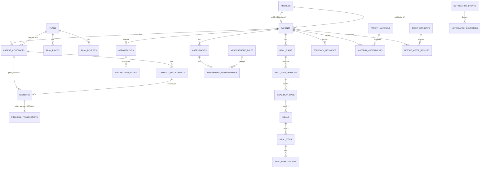

# DATABASE — Schema implementado (Fase 2)

Este documento descreve o schema **realmente implementado** em
`supabase/migrations/`. A versão anterior (Fase 0) era uma proposta; onde as
duas divergem, o que está aqui e nas migrations é o que vale — divergências
relevantes estão registradas em `docs/DECISIONS.md`.

Postgres 17 (Supabase local). Migrations em
`supabase/migrations/2026091321005X_*.sql`, aplicadas nessa ordem. Dado de
catálogo real (planos, métricas de avaliação) entra via migration; dado
fictício de desenvolvimento entra via `supabase/seed.sql` — nunca misturados
(ver `docs/DECISIONS.md`).

## Convenções

- PK `uuid default gen_random_uuid()` em toda tabela.
- `created_at timestamptz not null default now()`; `updated_at` mantido por
  trigger reutilizável (`public.set_updated_at()`), anexado tabela a tabela —
  nunca lógica duplicada.
- Dinheiro sempre `integer` em centavos (`amount_cents`), nunca float.
- Enums (`create type ... as enum`) para conjuntos fechados e estáveis
  (status, role, modality). Texto livre com `check` quando o conjunto deve
  crescer sem migration (`plans.code`, `measurement_types.code`,
  `notification_events.event_type`).
- FKs `on delete restrict` por padrão em dados financeiros/clínicos;
  `on delete cascade` só em filhos que não fazem sentido sem o pai (ex.:
  `meal_plan_days` sem `meal_plan_versions`); `on delete set null` quando a
  referência é só rastreabilidade.
- Soft delete (`archived_at`, `revoked_at`, `status`) onde há histórico
  dependente — nunca hard delete de paciente, contrato, pagamento, consulta.
- Índice em toda FK usada em filtro/join frequente.
- RLS habilitada em **toda** tabela — sem exceção (ver `docs/SECURITY.md`).

## Extensões

- `pgcrypto` — `gen_random_uuid()`.
- `btree_gist` — exclusion constraint anti-double-booking.
- `pgtap` (só ambiente de teste, não é uma dependência do schema de produção)
  — usado por `supabase/tests/database/*.sql`.

## Entidades (por migration)

| Migration | Tabelas | Papel |
|---|---|---|
| `..051_extensions_and_helpers` | — | Extensões, `set_updated_at()` |
| `..052_profiles` | `profiles` | Identidade/autenticação (extends `auth.users`) |
| `..053_patients` | `patients` | Dado de negócio do paciente (separado de profile) |
| `..054_rls_helper_functions` | — | `current_profile_role()`, `is_nutritionist_of_patient()`, `is_patient_self()` |
| `..055_plans` | `plans`, `plan_prices`, `plan_benefits` | Catálogo de planos versionável |
| `..056_contracts` | `patient_contracts`, `contract_installments` | Contrato ≠ plano ≠ parcela |
| `..057_scheduling` | `availability_rules`, `blocked_times`, `appointments`, `appointment_notes` | Agenda + anti-double-booking |
| `..058_financial` | `financial_categories`, `payments`, `financial_transactions` | Ledger financeiro |
| `..059_meal_plans` | `meal_plans`, `meal_plan_versions`, `meal_plan_days`, `meals`, `meal_items`, `meal_substitutions` | Cardápio versionado |
| `..060_assessments` | `measurement_types`, `assessments`, `assessment_measurements` | Avaliação flexível (catálogo + valor) |
| `..061_supplements_feedback_materials` | `supplement_recommendations`, `feedback_messages`, `patient_materials`, `material_assignments` | |
| `..062_food_photo_analyses` | `food_photo_analyses` | Estimativa de IA (sem IA real ainda) |
| `..063_blog` | `blog_categories`, `blog_tags`, `blog_posts`, `blog_post_tags` | CMS |
| `..064_results_and_consent` | `media_consents`, `before_after_results` | Nunca publica sem consentimento |
| `..065_notifications` | `notifications`, `notification_events`, `notification_deliveries` | Sem envio real ainda |
| `..066_site_settings` | `site_settings` | Vazia — nada inventado |
| `..067_audit_log` | `audit_logs` | Append-only |
| `..068_financial_views` | views `contract_financial_summary`, `patient_active_status` | Cálculos recorrentes |
| `..069_storage_buckets` | `storage.buckets` + policies | 5 buckets, 4 privados |
| `..070_plans_catalog_data` | dados em `plans`/`plan_prices`/`plan_benefits` | Catálogo real (não fictício) |
| `20260917120000_auth_profile_provisioning` | trigger em `auth.users` | Profile PATIENT automático (Fase 3) |
| `20260917120001_fix_validate_patient_profile_roles_rls` | — | Trigger de `patients` como SECURITY DEFINER (Fase 3) |
| `20260918120000_patients_contracts_management` | `patient_contracts.notes`, índice único de e-mail, view `patient_overview`, funções `create_contract_with_installments`/`cancel_contract`/`complete_contract` | Gestão de pacientes/contratos (Fase 5) |
| `20260923120000_patient_content_management` | `supplement_recommendations.dose_text/starts_on/ends_on/archived_at/by/updated_by` + check de `purchase_url`, `feedback_messages.title/reference_date/published_at/archived_at/by/updated_at/by`, `patient_materials.kind/description/external_url/file_name/file_size_bytes/archived_at/by/updated_by` (+ `storage_path` nullable, checks arquivo OU link), `material_assignments.assigned_by/revoked_by`, triggers `guard_supplement_recommendation`/`guard_feedback_message`/`guard_patient_material`/`guard_material_assignment`, `prevent_feedback_tampering_by_patient` reescrito, helper `material_visible_to_patient`, RLS do paciente restrita (ativo / disponibilizado / atribuído) em tabelas e bucket, DELETE revogado em suplementos e atribuições | Suplementos, feedbacks e materiais (Fase 10) |
| `20260922120000_assessment_management` | `assessments.assessment_date/visible_to_patient/published_at/internal_notes/archived_at/by/updated_by/report_*`, catálogo ampliado (altura, massa de gordura, metabolismo basal, circunferências) e `BMI` inativo, helper `assessment_visible_to_patient`, RLS do paciente por visibilidade (tabelas e bucket `bioimpedance-reports`), triggers `guard_assessment`/`guard_assessment_measurement`, função `set_assessment_measurements` | Avaliações/evolução (Fase 9) |
| `20260921120000_meal_plan_management` | `meal_plans.notes/start_date/archived_at/archived_by` + índice único de plano ativo por paciente, `meal_plan_versions.notes/published_by/archived_at`, `notes` em dias/refeições/substituições, `meal_substitutions.sort_order`, triggers de imutabilidade (`guard_meal_plan_content`, `guard_meal_plan_version`, `guard_meal_plan`), funções `create_meal_plan`/`create_meal_plan_version`/`publish_meal_plan_version`/`archive_meal_plan`/`discard_meal_plan_version`/`duplicate_meal`/`duplicate_meal_plan_day`, DELETE de planos revogado | Cardápio funcional (Fase 8) |
| `20260920120000_financial_management` | `financial_transactions.nutritionist_id`/`patient_id`/`notes`/cancelamento + trigger `guard_financial_transaction` + policies por dono, `payments.idempotency_key`/`notes`/`recorded_by`/cancelamento, view `installment_payment_summary`, `contract_financial_summary` com parciais, funções `record_manual_payment`/`cancel_payment`/`financial_period_summary`/`monthly_financial_series`, DELETE revogado | Financeiro completo (Fase 7) |
| `20260919120000_scheduling_management` | `scheduling_settings`, `appointments.cancellation_reason`/`created_by`, triggers `validate_appointment_ownership`/`validate_blocked_time_conflicts`, funções `busy_intervals`/`validate_booking_window`/`book_appointment`/`reschedule_appointment`, policy de auditoria do paciente | Agenda e agendamento (Fase 6) |

## Decisão de modelagem: avaliações flexíveis (não colunas fixas)

`measurement_types` (catálogo: código, nome, unidade) + `assessments` (um
"encontro de medição") + `assessment_measurements` (valor por métrica),
em vez de dezenas de colunas fixas em `bioimpedance_assessments` como a
Fase 0 havia proposto. Decisão explícita do prompt da Fase 2 — nenhum campo é
obrigatório por paciente; novas métricas entram como linha de catálogo, sem
migration. Ver `docs/DECISIONS.md`.

## Anti-double-booking

```sql
alter table public.appointments
  add constraint appointments_no_overlap
  exclude using gist (
    nutritionist_id with =,
    tstzrange(starts_at, ends_at, '[)') with &&
  )
  where (status in ('SCHEDULED', 'CONFIRMED', 'COMPLETED', 'NO_SHOW'));
```

- `'[)'` (fechado no início, aberto no fim) permite consultas adjacentes
  (10:00–11:00 e 11:00–12:00) sem falso conflito.
- `CANCELLED` e `RESCHEDULED` ficam fora do predicado — liberam o horário.
- Validado por teste real de duas conexões concorrentes
  (`scripts/db-concurrency-test.mjs`, `npm run test:db:concurrency`): das duas
  gravações simultâneas para o mesmo horário, exatamente uma sucede.

## Agenda e agendamento (Fase 6)

- **`scheduling_settings`** (uma linha por nutricionista): duração padrão,
  granularidade de início dos slots, antecedência mínima para agendar e para
  cancelar/reagendar (NULL = sem regra), horizonte máximo, `patient_can_book`,
  `patient_can_choose_modality`, `timezone`. Defaults de coluna (60/30 min)
  são técnicos — os reais são PENDENTE DE DEFINIÇÃO. Leitura por qualquer
  autenticado, escrita só do dono.
- **`appointments`** ganhou `cancellation_reason` e `created_by`. A exclusion
  constraint da Fase 2 continua intocada. Trigger
  `validate_appointment_ownership` (SECURITY DEFINER): `nutritionist_id` =
  responsável pelo paciente; PATIENT só insere `SCHEDULED` sem valor e só
  atualiza para `CANCELLED`/`RESCHEDULED` a partir de ativo, sem trocar
  paciente/nutricionista/contrato/valor.
- **`blocked_times`**: trigger `validate_blocked_time_conflicts` recusa
  bloqueio sobre consulta SCHEDULED/CONFIRMED (`BLOCKED_TIME_CONFLICT`).
- **`busy_intervals(nutritionist, from, to)`** (SECURITY DEFINER): só
  `starts_at`/`ends_at`/`kind` de consultas ativas + bloqueios — base do
  cálculo de horários livres do paciente sem ler consultas alheias.
- **`validate_booking_window`**: futuro (+ antecedência), horizonte, regra
  ativa do dia da semana no fuso configurado (consulta inteira dentro de UMA
  regra, mesmo dia civil), modalidade compatível, fora de bloqueio.
  **`book_appointment`**: PATIENT só para si (cadastro ACTIVE e
  `patient_can_book`), sempre validado; NUTRITIONIST para paciente próprio,
  validado salvo `p_allow_outside_availability = true` (override explícito;
  passado nunca). **`reschedule_appointment`**: original → `RESCHEDULED` +
  nova consulta ligada por `rescheduled_to_id`, copiando contrato/valor, numa
  transação. Sobreposição em qualquer caso é decidida pela constraint
  (23P01).
- Policy `audit_logs_insert_patient_appointment`: paciente audita só
  `entity_type = 'appointment'` com `actor_id = auth.uid()`.
- Índice novo: `appointments (status, starts_at)`.

## Gestão de pacientes e contratos (Fase 5)

- **`patient_overview`** (view, `security_invoker = true`): uma linha por
  paciente com `has_active_contract`, `is_effectively_active` (mesma regra
  de `patient_active_status`: status manual ACTIVE **e** contrato ACTIVE),
  o contrato ACTIVE mais recente (`current_contract_id`, plano, valor,
  período) e a próxima consulta SCHEDULED/CONFIRMED. É o que a listagem do
  dashboard pagina/filtra/busca pelo PostgREST — sem N+1.
- **`patients_nutritionist_email_unique_idx`**: único parcial em
  `(nutritionist_id, lower(email)) where email is not null` — e-mail
  duplicado no mesmo nutricionista nunca é criado, nem em corrida.
- **`create_contract_with_installments(patient, plan, start, amount,
  installments jsonb, [price], [end], [notes])`**: SECURITY INVOKER (RLS
  vale dentro), transacional; valida ownership (`nutritionist_id =
  auth.uid()`), plano ativo, preço do mesmo plano, período, soma exata das
  parcelas e numeração 1..n; parcelas nascem PENDING. Erros são códigos
  estáveis (`PATIENT_NOT_FOUND`, `PLAN_NOT_AVAILABLE`,
  `INVALID_CONTRACT_PERIOD`, `INVALID_INSTALLMENTS`).
- **`cancel_contract(id)`**: ACTIVE → CANCELLED + `cancelled_at`; parcelas
  PENDING/OVERDUE → CANCELLED; PAID, pagamentos e lançamentos intactos.
  **`complete_contract(id)`**: ACTIVE → COMPLETED, parcelas intactas.
  Transição inválida → `INVALID_STATUS_TRANSITION`; contrato invisível
  pela RLS → `CONTRACT_NOT_FOUND`.
- Regra de parcelas (aplicação, `src/domain/contracts/installments.ts`):
  remainder de centavos nas primeiras parcelas; vencimentos mensais com
  dia-âncora do primeiro vencimento limitado ao fim do mês (31/01 → 28/02 →
  31/03 → 30/04). Ver `docs/DECISIONS.md`, Fase 5.
- Desativar paciente = `status = 'INACTIVE'` + `archived_at`; reativar
  limpa ambos. Nunca DELETE.

## Idempotência financeira

- `payments`: índice único parcial em `(provider, external_id)` — mesmo
  webhook reenviado não duplica pagamento.
- `financial_transactions`: índice único parcial em `origin_payment_id` — um
  pagamento nunca gera duas linhas de receita (testado em
  `supabase/tests/database/010_constraints.test.sql`).
- `contract_financial_summary` (view, `security_invoker = true`) calcula
  contratado/recebido/pendente/previsto a partir de `payments` e
  `contract_installments` — nunca do valor total do contrato de uma vez
  (testado com o cenário R$1.200/6x/2 pagas em `040_financial_summary.test.sql`).
- **Fase 7 (pagamento manual):** `payments.idempotency_key` (índice único
  parcial) — o formulário gera a chave no servidor e `record_manual_payment`
  devolve o mesmo pagamento em reenvio/clique duplo. `installment_payment_summary`
  dá recebido/restante por parcela (parcial permitido; a maior recusado com
  `PAYMENT_EXCEEDS_INSTALLMENT`); a parcela só vira `PAID` quando quitada e o
  status `PARTIAL`/`OVERDUE` é derivado na aplicação. `cancel_payment` marca
  `REFUNDED` (mantém `paid_at`), cancela o lançamento e reabre a parcela.
  `financial_transactions` e `payments` não aceitam DELETE (histórico).

## RLS — funções auxiliares

`public.current_profile_role()`, `public.is_nutritionist_of_patient(uuid)`,
`public.is_patient_self(uuid)` e `public.has_valid_media_consent(uuid)`:
`SECURITY DEFINER`, `search_path = ''` (todos os identificadores
schema-qualificados no corpo), `EXECUTE` restrito a `authenticated`
(`has_valid_media_consent` também a `anon`, porque a policy pública de
antes/depois precisa dela). Cada uma só devolve um boolean/role — nunca uma
linha de dado alheio. Detalhe completo em `docs/SECURITY.md`.

## Storage

| Bucket | Público | Path | Acesso |
|---|---|---|---|
| `patient-documents` | não | `<material_id>/<uuid>.<ext>` (Fase 10; trigger valida o prefixo) | nutricionista dono; paciente via `material_visible_to_patient` (atribuição não revogada + material não arquivado e completo) |
| `meal-photos` | não | `<patient_id>/arquivo` | paciente dono; nutricionista responsável |
| `bioimpedance-reports` | não | `<patient_id>/arquivo` | paciente dono; nutricionista responsável |
| `before-after` | **não** (mesmo publicado) | `<before_after_results.id>/arquivo` | nutricionista; paciente dono. Entrega pública é server-side (signed URL, Fase 14) — nunca via storage RLS para `anon` |
| `blog` | sim | `<post_id>/arquivo` | leitura pública; escrita só nutricionista |

## ERD (simplificado)



## Testes de banco

- `supabase/tests/database/010_constraints.test.sql` — unicidade/checks
  críticos (preço primário único, parcela duplicada, idempotência de
  pagamento/transação, versão publicada única, publicação sem consentimento).
- `020_appointments_overlap.test.sql` — adjacência permitida, sobreposição
  real rejeitada, `CANCELLED`/`RESCHEDULED` liberam horário.
- `030_rls_patient_isolation.test.sql` — IDOR entre pacientes (7 tabelas) e
  entre nutricionistas.
- `040_financial_summary.test.sql` — cenário R$1.200/6x/2 pagas.
- `090_financial.test.sql` — pagamento manual (parcial/total/a maior/
  idempotente/parcela cancelada), estorno, trigger de lançamentos, DELETE
  negado, consultas x financeiro (concluir/reagendar não geram receita),
  RLS/ownership entre nutricionistas, previsão por contrato.
- `100_meal_plans.test.sql` — plano único ativo, duplicar refeição/dia
  (ids novos, destino preservado), publicação (estrutura mínima, v1
  arquivada ao publicar v2, nunca duas publicadas), imutabilidade da
  versão publicada, descarte só de rascunho, paciente A só PUBLISHED /
  paciente B nada, nutri B nada, arquivamento e novo plano com base.
- `110_assessments.test.sql` — data futura, ranges técnicos (0/negativo/
  101%), função de medidas (upsert + remoção, precisão), mass assignment
  (patient_id, report_path), visibilidade (paciente só liberada; medidas
  idem), paciente/nutri B nada, arquivar/excluir (só nunca exibida), RLS do
  bucket privado (paciente só objeto de avaliação visível).
- `120_patient_content.test.sql` — suplementos (ativo x encerrado x
  arquivado, URL insegura, imutabilidade, DELETE negado), feedbacks
  (rascunho invisível, disponibilizar definitivo, paciente só `read_at`,
  arquivar, apagar só rascunho), materiais (link x arquivo, path fora do
  padrão, incompleto não atribuível, atribuição única, material alheio
  recusado por trigger, revogar/reatribuir, arquivar, delete só sem
  histórico) e RLS do bucket `patient-documents` (paciente A só quando
  atribuído; B e nutri B nada).
- `050_public_visibility.test.sql` — blog e antes/depois só públicos quando
  deveriam.
- `070_patients_contracts_management.test.sql` — índice único de e-mail,
  `patient_overview` (status derivado, contrato atual, RLS entre
  nutricionistas), funções de contrato (sucesso, validações, ownership com
  ids adulterados, cancelar/encerrar preservando histórico), resumo
  financeiro do contrato novo.
- `scripts/db-concurrency-test.mjs` (`npm run test:db:concurrency`) — duas
  conexões reais disputando o mesmo horário.
- `scripts/patients-integration-test.mjs` (`npm run test:patients:integration`)
  — o mesmo via PostgREST/GoTrue com JWTs reais de dois nutricionistas e de
  um paciente.
- `080_scheduling.test.sql` — ownership de appointments, restrições do
  paciente, bloqueio x consulta, busy_intervals, book/reschedule (janela,
  ids adulterados, histórico), adjacência, cancelamento liberando horário,
  auditoria do paciente, override do nutricionista.
- `scripts/scheduling-integration-test.mjs` (`npm run
  test:scheduling:integration`) e `scripts/scheduling-concurrency-test.mjs`
  (`npm run test:scheduling:concurrency` — 2 pacientes no mesmo slot,
  nutricionista + paciente, 2 reagendamentos para o mesmo destino: sempre 1
  sucesso e 1 recusa 23P01).

Rodar tudo: `npm run db:start` (uma vez) → `npm run test:db` → `npm run test:db:concurrency`.

## Suplementos, feedbacks e materiais (Fase 10)

- **`supplement_recommendations`**: status derivado — `archived_at` ⇒
  ARQUIVADA (irreversível, só leitura), senão `active` ⇒ ATIVA/ENCERRADA.
  Paciente só lê ATIVA e não arquivada. `purchase_url` só `^https?://`
  (check). `created_by/updated_by/archived_by` pelo trigger; `patient_id`
  imutável; DELETE revogado.
- **`feedback_messages`**: `published_at` null = rascunho (invisível ao
  paciente); disponibilizar é definitivo; `archived_at` oculta. Paciente só
  altera `read_at` (trigger compara o resto). Nutricionista edita mesmo
  após disponibilizar (`updated_at/updated_by`); DELETE só de rascunho
  (`FEEDBACK_NOT_DELETABLE`); `author_id = auth.uid()` no insert.
- **`patient_materials`**: `kind` FILE (arquivo no bucket, `storage_path`
  null enquanto o upload não concluiu = incompleto) ou LINK
  (`external_url` só `^https?://`) — nunca os dois (check).
  `storage_path` sempre `<id>/…` (trigger). Arquivado = só leitura, não
  atribuível, invisível ao paciente; DELETE só sem atribuições.
- **`material_assignments`**: única por (material, paciente); revogar =
  `revoked_at/by`; reatribuir = `revoked_at = null` (trigger renova
  `assigned_at/by`); trigger exige material e paciente do mesmo
  nutricionista, material não arquivado e completo; DELETE revogado.
- **`material_visible_to_patient(material_id)`** (SECURITY DEFINER,
  `search_path = ''`): base das policies do paciente em `patient_materials`,
  `material_assignments` e `storage.objects` (`patient-documents`).
- `notification_events`: `SUPPLEMENT_RECOMMENDATION_CREATED`,
  `FEEDBACK_PUBLISHED`, `MATERIAL_ASSIGNED` (sem entrega).
